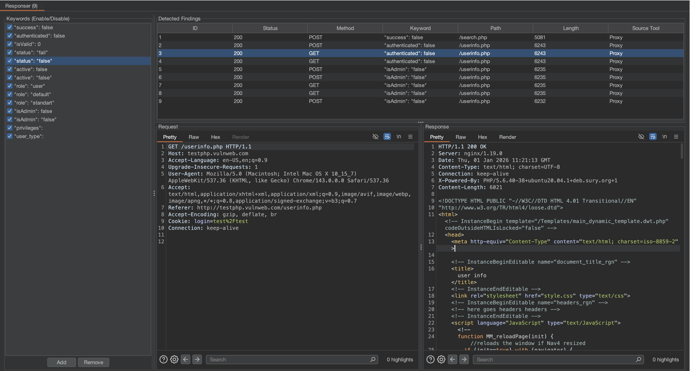

# Responser - Automated Response Manipulation & Bypass Hunter

**Responser** is a lightweight yet powerful Burp Suite extension written in Python (Jython) designed to monitor HTTP traffic in real-time. It automatically flags specific keywords, JSON fragments, or sensitive patterns within HTTP responses, helping security researchers and bug hunters stay focused on what matters.

## Screenshots

## 🚀 Why Responser?
During a security audit or bug bounty hunt, thousands of requests pass through Burp Suite. Responser helps you cut through the noise by instantly flagging interesting data based on your custom criteria. It is particularly useful for detecting privilege escalation clues, hidden debug information, and sensitive data leaks that are often missed in manual reviews.

## 🛠 Customizable Monitoring & Search Techniques
Responser is not limited to a static list. It is a flexible monitoring platform that you can adapt for various testing scenarios:

* **Auth & Privilege Escalation:** Detect authorization issues by monitoring for keywords like `"isAdmin": false`, `"role": "user"`, or `"authenticated": true`.
* **Sensitive Data Leakage:** Track PII (Personally Identifiable Information) patterns such as `"email":`, `"phone":`, or `api_key`.
* **Error & Debug Hunting:** Catch server-side misconfigurations by searching for `stacktrace`, `SQL syntax error`, `Internal Server Error`, or `debug: true`.
* **JSON Logic Monitoring:** Search for specific logic fragments like `{"status": 200}` or `"success": false` to verify application behavior across different roles.

## ✨ Key Features
* **Real-time Monitoring:** Seamlessly hooks into Proxy, Repeater, and Intruder.
* **Dynamic Keyword Management:** Enable or disable specific keywords on-the-fly using **Checkboxes** without deleting them from your list.
* **Optimized Data Table:** View findings organized by **ID, Status, Method, Keyword, Path, Length, and Source Tool.**
* **Integrated Message Viewers:** Click on any finding to instantly inspect the original **Request** and **Response** in the built-in editor.
* **Read-Only Data Integrity:** The findings table is protected against accidental edits to ensure data consistency.
* **Professional UI:** A clean, English interface designed for high-efficiency workflows.

## 📦 Installation
1.  Download the `Responser.py` file from this repository.
2.  Ensure you have [Jython](https://www.jython.org/download) configured in your Burp Suite (**Extensions** -> **Options** -> **Python Environment**).
3.  Go to the **Extensions** tab -> **Installed** -> **Add**.
4.  Set **Extension Type** to `Python`.
5.  Select `Responser.py` as the file and click **Next**.

## 💡 Pro Tip
While testing, if you notice a new interesting parameter or a specific error message, simply add it to the "Keywords" panel. Responser will immediately start flagging it in all subsequent traffic, effectively acting as an automated "second pair of eyes."

## 📜 License
This project is licensed under the **MIT License** - feel free to use, modify, and distribute!
